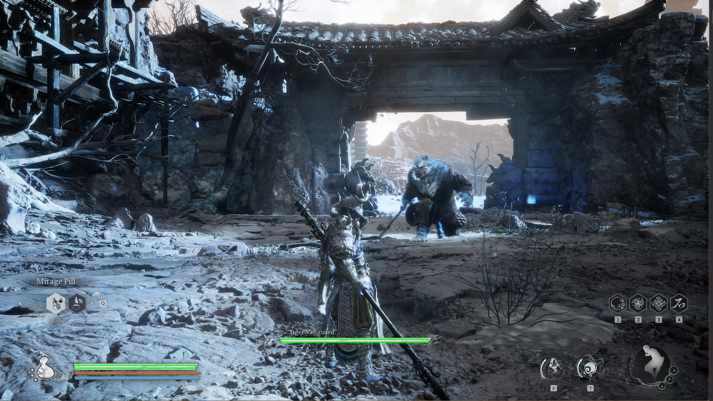

## Project Summary
Our goal is to create an AI agent that can defeat the bosses in a video game called Black Myth: Wukong, which is a Chinese Action RPG. 

Currently, we consider the input for our AI is the screen capturing during the game, as well as the boss and player HP bars, and the output should be a model that is able to take actions to earn the highest possible rewards.

The application of this project includes making reliable AI agent that may help the user to choose the best strategy for defeating the boss in an Action RPG.

## Approach
The agent uses Proximal Policy Optimization (PPO), a policy gradient method designed to improve stability and convergence during training. PPO is particularly effective in environments with large action spaces and high-dimensional inputs.

During the game, the AI agent controls a character and takes actions based on the game scenario. To set up the environment, we extract the character's and boss's health bars, process the real time screenshot into a numpy matrix, and include the last 10 actions taken. These form the observation space, which represents the environment.

Next, we define 12 available actions for the AI to choose from, such as moving forward or backward, dodging, light and heavy attacks, charging a heavy attack, casting 4 different spells, and more. The AI will decide which action to take based on the current state of the environment.

Finally, we establish the reward system. There are two types of rewards:

One-time rewards: These include positive rewards for healing the character and damaging the boss, as well as negative rewards when the character takes damage from the boss.
Long-term rewards: These are given at each step and include:
A positive reward for avoiding damage from the boss for more than 4 seconds.
A negative reward for failing to damage the boss for 4 seconds.
A positive reward based on how low the boss's health is.
A negative reward when the player’s health is low.
These rewards encourage the AI to make good decisions, such as healing when its health is low, attacking the boss effectively, and avoiding damage.

After setting up the program, we begin to train the model by letting AI agent challenge the boss again and again. For now, we have trained it for more than 40k steps.

## Evaluation

## Remaining Goals and Challenges
Train more bosses.

Lower the equipments.

make a common model.

## Resources Used
SPECIAL THANKS to EldenRL repository, for providing us the inspiration to make this project possible, link: https://github.com/ocram444/EldenRL
mss for screenshot; gym and stable-baselines3 for training AI agent; opencv-python, matplotlib and numpy for image processing; pytesseract for text identification; pydirectinput for keyboard controlling;
